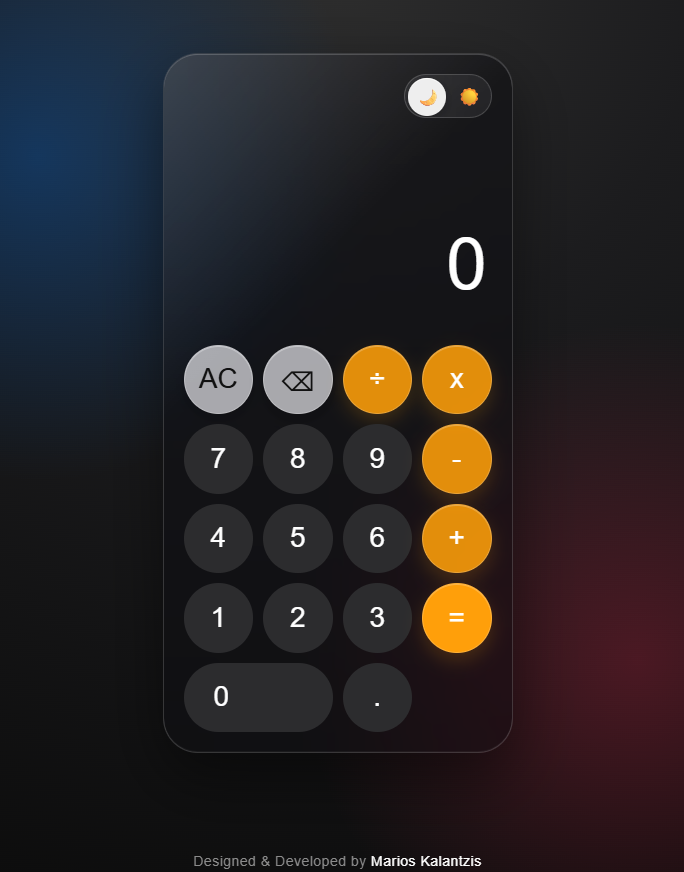

# Glass Calculator

A modern calculator built with HTML, CSS and JavaScript.

It features a glassmorphism interface, dark/light themes and supports the four basic arithmetic operations.

## Preview

## Features

- Glassmorphism user interface
- Dark / Light theme
- Responsive layout
- Splash screen
- Four basic arithmetic operations
- Decimal calculations
- Keyboard support
- Division by zero protection
- Prevents invalid operator sequences
- Ignores unsupported keyboard input

## Technologies Used

- HTML5
- CSS3
- Vanilla JavaScript (ES6)
- Git
- GitHub

## What I Learned

Building this calculator taught me much more than just writing code.

- I gained a better understanding of state and why managing application state is important, even though I know I still have a lot to learn.
- I learned to think ahead and implement proper error handling instead of only focusing on the "happy path".
- I realized that turning an idea into working code is much more challenging than it first appears. Breaking problems into smaller pieces and solving them step by step became one of the most valuable lessons of this project.
- I became more comfortable reading documentation and asking for guidance when I got stuck. Learning how to find information and collaborate with more experienced developers was an important part of completing this project.

 ## Future Improvements

- Add calculation history
- Persist theme preference using Local Storage
- Add scientific calculator functions
- Improve accessibility (ARIA labels and screen reader support)
